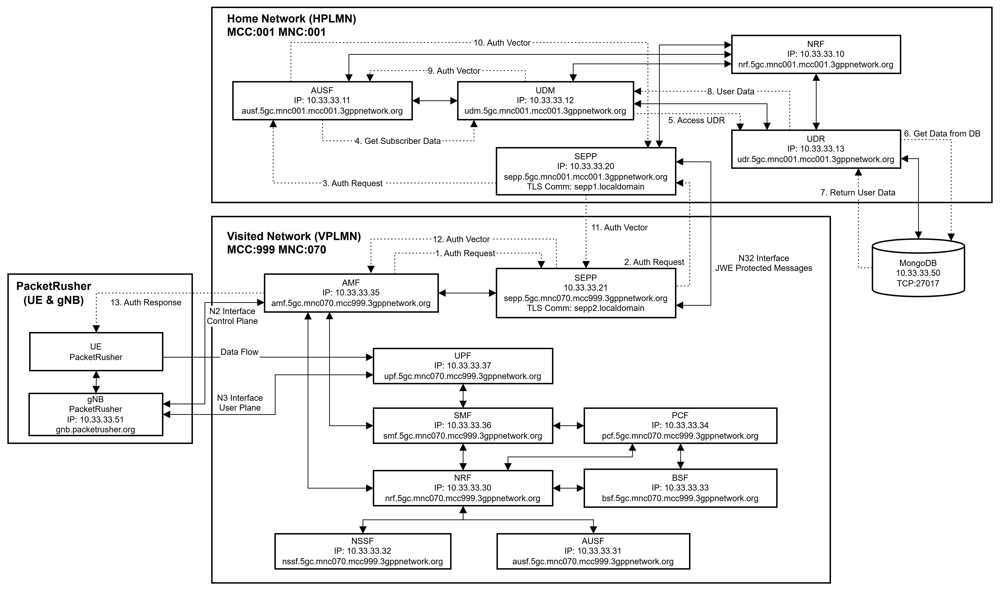

# Open5GS Network Debugging with tshark

## Overview

This guide documents how to set up comprehensive packet capture for an Open5GS 5G core network running in Docker containers. The setup uses a dedicated tshark container with host networking to monitor all traffic on the "br-ogs" bridge network.

## Setup Process

### 1. Create a Separate Docker Compose File

Create a file named `tshark-compose.yml`:

```yaml
version: '3'

services:
  #other
  tshark:
    container_name: tshark
    image: 'nicolaka/netshoot'
    command: >
      sh -c "mkdir -p /captures &&
             chmod 777 /captures &&
             echo 'Starting packet capture...' &&
             # Capture all traffic on br-ogs interface
             tshark -i br-ogs -w /captures/open5gs_all.pcap -P &
             # Specific protocol captures
             tshark -i br-ogs -f 'port 7777 or port 8777' -w /captures/sepp_sbi.pcap -P &
             tshark -i br-ogs -f 'port 7778 or port 7779 or port 8778 or port 8779' -w /captures/n32_interfaces.pcap -P &
             tshark -i br-ogs -f 'sctp' -w /captures/n1_n2_interfaces.pcap -P &
             tshark -i br-ogs -f 'udp port 2152' -w /captures/n3_interface.pcap -P &&
             echo 'Packet capture started successfully' &&
             tail -f /dev/null"
    network_mode: 'host'
    cap_add:
      - NET_ADMIN
      - NET_RAW
    volumes:
      - ./captures:/captures
    restart: unless-stopped
```

### 2. Setup and Execution Commands

```bash
# Create captures directory with proper permissions
mkdir -p ./captures
chmod 777 ./captures

# Ensure the network exists (if not already created by Open5GS)
docker network create --driver bridge --subnet 10.33.33.0/24 \
  --opt "com.docker.network.bridge.name=br-ogs" open5gs 2>/dev/null || true

# Start tshark container first to ensure it captures all traffic
docker-compose -f tshark-compose.yml up -d

# Wait a moment for tshark to initialize
sleep 2

# Then start your Open5GS services
docker-compose up -d
```

### 3. Network IPV4 Address Table

# 5G Network Components (Roaming Scenario)

| Network Function | Description                      | Home PLMN<br/>(MNC: 001, MCC 001) | Visited PLMN<br/>(MNC: 070, MCC 999) |
| ---------------- | -------------------------------- | --------------------------------- | ------------------------------------ |
| NRF              | Network Repository Function      | 10.33.33.10                       | 10.33.33.30                          |
| AUSF             | Authentication Server Function   | 10.33.33.11                       | 10.33.33.31                          |
| UDM              | Unified Data Management          | 10.33.33.12                       | -                                    |
| UDR              | Unified Data Repository          | 10.33.33.13                       | -                                    |
| NSSF             | Network Slice Selection Function | -                                 | 10.33.33.32                          |
| BSF              | Binding Support Function         | -                                 | 10.33.33.33                          |
| PCF              | Policy Control Function          | -                                 | 10.33.33.34                          |
| AMF              | Access and Mobility Management   | -                                 | 10.33.33.35                          |
| SMF              | Session Management Function      | -                                 | 10.33.33.36                          |
| UPF              | User Plane Function              | -                                 | 10.33.33.37                          |
| SEPP             | Security Edge Protection Proxy   | 10.33.33.20                       | 10.33.33.21                          |
| gNB              | gNodeB                           | 10.33.33.51                       | 10.33.33.51                          |
| UE               | User Equipment                   | -                                 | -                                    |
| db               | mongodb                          | 10.33.33.50                       | 10.33.33.50                          |

### 3. Network Interfaces and Protocols Captured

| Capture File          | Target      | Protocol/Port              | 5G Interface   |
| --------------------- | ----------- | -------------------------- | -------------- |
| open5gs_all.pcap      | All traffic | All                        | All interfaces |
| sepp_sbi.pcap         | SEPP SBI    | TCP 7777, 8777             | N32 SBI        |
| n32_interfaces.pcap   | SEPP N32c/f | TCP 7778, 7779, 8778, 8779 | N32c, N32f     |
| n1_n2_interfaces.pcap | AMF-RAN     | SCTP                       | N1, N2         |
| n3_interface.pcap     | UPF-RAN     | UDP 2152 (GTP-U)           | N3             |

## Accessing Captured Traffic

```bash
# List capture files
ls -la ./captures

# Copy files to another location
cp ./captures/open5gs_all.pcap ~/analysis/

# Transfer files to a remote server
scp ./captures/sepp_sbi.pcap user@remote-server:/destination/

# View with Wireshark (if installed)
wireshark ./captures/n1_n2_interfaces.pcap &
```

## Open5gs Roaming Setup



This setup allows you to debug and analyze the complete communication flows between all network functions in your Open5GS environment, focusing on critical interfaces like the N32 roaming interfaces between SEPPs.
